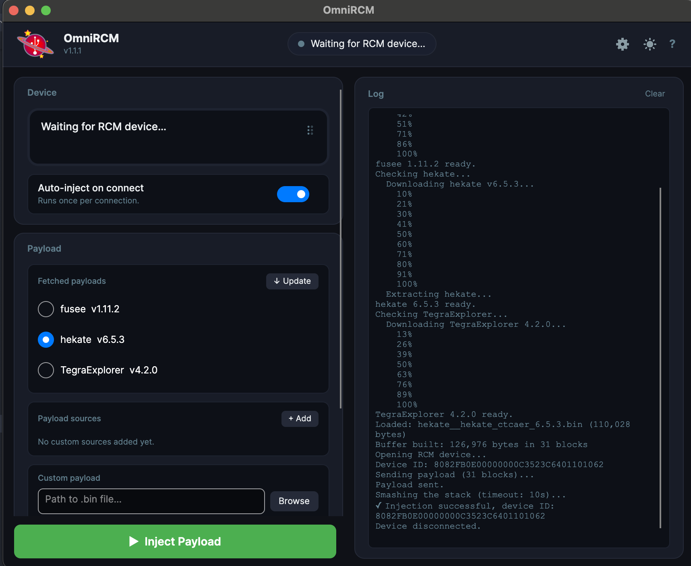

# How to Mod Switch

````{note}
All mods recommended are ones that are wifi safe (ie Nintendo won't detect when play online and brick/block switch)
````

# Pre Requisites

````{list-table}
:header-rows: 1

* - Link
  - Description
* - Modable Switch
  - Need older switch or make hardware changes to ensure modable (check if moddable via [link](https://www.youtube.com/watch?v=HRqm3SEH-Fs&t=1240s))
* - Physical RCM Jig
  - Small device that goes into joystick slot on switch that allows to mod (can buy on [amazon](https://www.amazon.com/RGEEK-Nintendo-Circuit-Archive-Simulator/dp/B07Q6YHRBM/ref=sr_1_1?crid=ASUBHUF9NP4G&dib=eyJ2IjoiMSJ9.EfGhx3NZTLDYN8azz1XQ0G4OSJP6mEe5GBx8mLu7e0E7T7ZmtxtjqCgoAYeYYlW76IXK-TYY4bzFatLadIwsLZYA69UWrBIMX9N9TEpESIk.6x3Jn7fy2BbsJsJt8BHWBzqWdz3E4dsBhQEoQD2DyRM&dib_tag=se&keywords=physical+RCM+jig&qid=1786934749&s=electronics&sprefix=physical+rcm+jig%2Celectronics%2C151&sr=1-1))
* - Micro SD
  - Where mod software and mods are stored on
````

# Download

````{list-table}
:header-rows: 1

* - Link
  - File
* - [Atmosphere (Latest Release)](https://github.com/atmosphere-nx/atmosphere/releases)
  - `atmosphere....zip`
* - [Hekate (Latest Release)](https://github.com/CTCaer/hekate/releases)
  - `hekate_ctcaer_...zip`
* - [OmniRCM (Latest Release)](https://github.com/DefenderOfHyrule/OmniRCM/releases/tag/v1.1.1)
  - `OmniRCM-osx.zip` (Mac OS) (follow [instructions](https://switch.hacks.guide/user_guide/rcm/sending_payload?tab=macos) to use)
* - [SD Preparation](https://switch.hacks.guide/user_guide/all/sd_preparation)
  - `hekate_ipl.ini` file (ie referenced as "hekate config file")
* - Acropolis (Latest Release)](https://github.com/Raytwo/ARCropolis/releases/)
  - `release.zip`
* - [Skyline (Latest Release)](https://github.com/skyline-dev/skyline/releases)
  - `skyline.zip`
* - [Nro Hook (Latest Release)](https://github.com/ultimate-research/nro-hook-plugin/releases)
  - `libnro_hook.nro`
* - [Smashline (Latest Release)](https://github.com/HDR-Development/smashline/releases)
  - `libsmashline_plugin.nro`
* - [ImgUI Smash (Latest Release)](https://github.com/Coolsonickirby/imgui-smash/releases)
  - `libimgui_smash.nro`
* - [SSBU PIA Interface (Latest Release)](https://github.com/project-ultelier/ssbu-pia-interface/releases/tag/v1.2.0)
  - `libssbu_pia_manager.nro`
````

# Steps

````{list-table}
:header-rows: 1

* - Step
  - Description
* - 0
  - Ensure have [pre requisites](#pre-requisites)
* - 1
  - Ensure micro SD was in switch turned on (so has `Nintendo` folder)
* - 2
  - Remove micro SD from switch and plug micro SD card into computer
* - Ste3p
  - In Downloads, Move  in `hekate_ctcaer` folder and copy `hekate...bin` file to desktop & move `bootloader` folder to root of micro SD
* - 4
  -  In Downloads, Move `hekate_ipl.ini` file to `bootloader` folder of micro SD (NOTE: may have downloaded with `.txt` extension, ensure just `.ini` at end of file)
* - 5
  -  In Downloads, Move `atmosphere` folder (from Acropolis) into micro SD (when prompted merge, don't replace)
* - 6
  -  In Downloads, Move `exefs` folder (from Skyline), into micro SD `atmopshere/contents/01006A800016E000` folder (the `01006A800016E000` represents the smash ultimate game id)
* - 7
  -  In Downloads, Move `atmosphere` folder (from Training Mod Pack) into micro SD (when prompted merge, don't replace)
* - 8
  -  In Downloads, Move `atmosphere` folder (from SSBU Online Deluxe) into micro SD (when prompted merge, don't replace)
* - Step
  -  In Downloads, Move all `.nro` files into micro SD `atmopshere/contents/01006A800016E000/skyline/plugins` folder
* - 9
  - Eject micro SD, Turn off swtich (ie hold power mode and select "Turn Off"), and put micro SD in switch
* - 10
  - Put RCM jig into right joycon slot, slide all the way down
* - 1
  - Boot up RCM mode via `+ Volume` + `Power Button` for 3 seconds
* - Open OmniRCM app on computer and plugin swtich via USB-C, Toggle `Auto-Inject on Connect` & select `hekate`, press `Inject Payload` (you should see switch boot up with Nyx)
* - 12
  - On Switch, after putting time and date, hit `Launch`, selecting `Atmosphere Sysmmc` option (switch should launch normally)
* - 13
  - Select "Smash Ultimate", should see "New Mods detected" pop up, click "yes"
````

# Smash Ultimate Mods

````{list-table}
:header-rows: 1

* - Link
  - Description
* - [Skins](https://gamebanana.com/mods/cats/3330)
  - Cosmetic changes to skins/alts of characters (broken down by character), see [vod](https://youtu.be/HRqm3SEH-Fs?si=6UnDAirbChRJBqTh&t=873) how to add
* - Ultimate Training Mod Pack (Latest Version)](https://github.com/jugeeya/UltimateTrainingModpack/releases#release-beta)
  - Better improved training mod (to download, go to first release after `beta`, download `TrainingModpack.zip`)
* - [SSBU Online Deluxe (Latest Release)](https://github.com/saad-script/ssbu-online-deluxe/releases/tag/v1.3.0)
  - Allows ofr online arenas to feel like offline (download `ssbu-online-deluxe-....zip`)
````

# References
%TODO: add https://github.com/saad-script/ssbu-emu-optimizer
````{list-table}
:header-rows: 1

* - Link
  - Description
* - [How to Mod Switch Vod 1](https://www.youtube.com/watch?v=r3FFUkzwWQI) [How to Mod Switch Vod 2](https://www.youtube.com/watch?v=HRqm3SEH-Fs&t=1240s)
  - How to make switch moddable and basics of Smash Ultimate Modding
* - [How to Update Mod Software](https://www.youtube.com/watch?v=vAULmYf5R4Y)
  - How to update existing mod software (Eg Acropolis/plugins)
* - [Full Switch Mod Guide](https://switch.hacks.guide)
  - Full community guide for modding switch in technical detail
````

# Appendix

